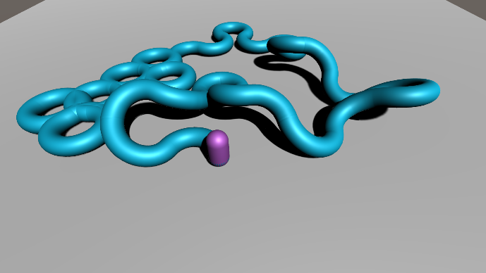
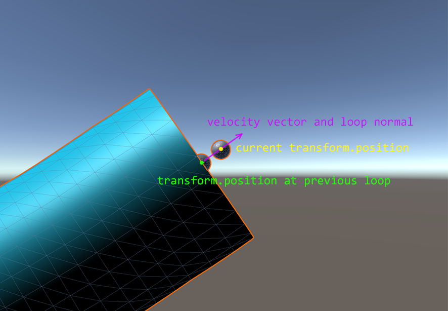
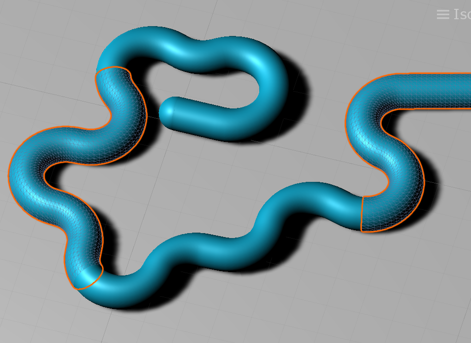

# Tubular

This Unity Package contains a tube generator which creates 3-dimensional trails following a moving transform which you can start, stop, and delete.

### Overview

Tubular dynamically creates and updates a mesh by adding loops of vertices which are oriented such that the normal of the loop is parallel with the velocity vector of the transform.

Each tube is segmented with each segment parented under one parent object and the length of each segment can be changed via SegmentLength.

### Functionality

| function  | description  |
| ------------ | ------------ |
| `StartTube(float radius, Material material)`  | Starts a new tube  |
| `CloseTube()`   | Closes the current tube  |
| `ClearTubes()`  | Deletes all tube objects from the scene including the current one   |
| `ClearTubeAtIndex(int index)`  | Deletes a tube at the specified index  |

### Configuration
|property  | default |description  |
| ------------ | ------------ |------------ |
| `VertsPerLoop`  |25| the smoothness of the tube  |
| `SegmentLength`   | 10| the length of a tube segment  |
| `DistanceBetweenLoops`  | 0.01| the minimum distance the transform has to move before  a new set of vertices is added to extend the mesh|

### Example

The example folder contains a simple character controller and tube controller.
(Open SampleScene and try up, left, right arrow keys to move, space to jump, right ctrl/alt to close/open tube, del to delete all tubes).

### Limitations

To ensure smooth tubes the transform must be moved in a smooth manner (no sharp turns).

If the distance that the transform moves per frame is greater than DistanceBetweenLoops you may see a gap between the transform and the tube opening.

